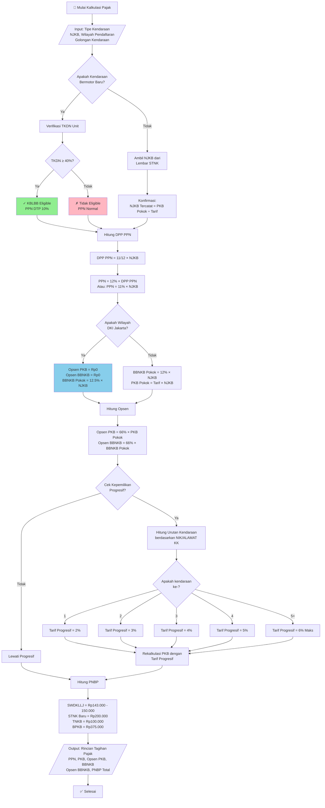
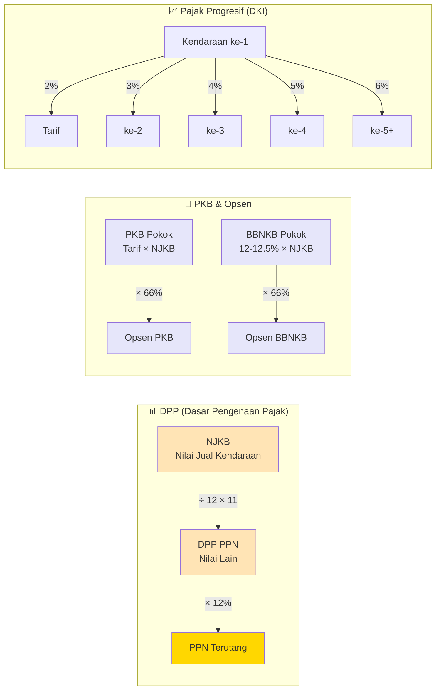
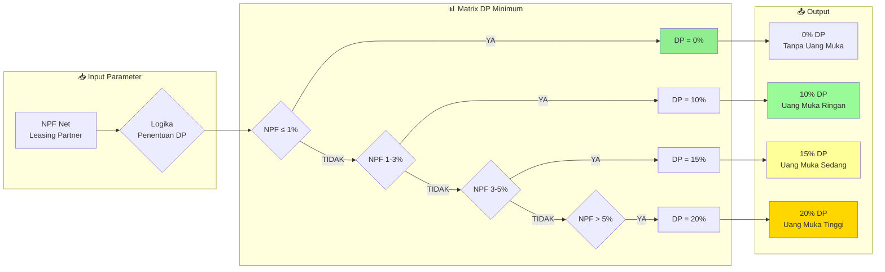
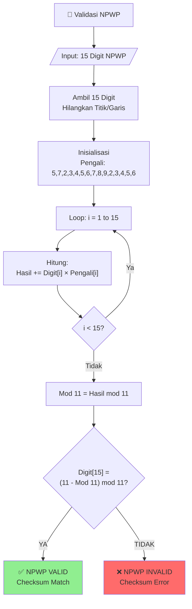
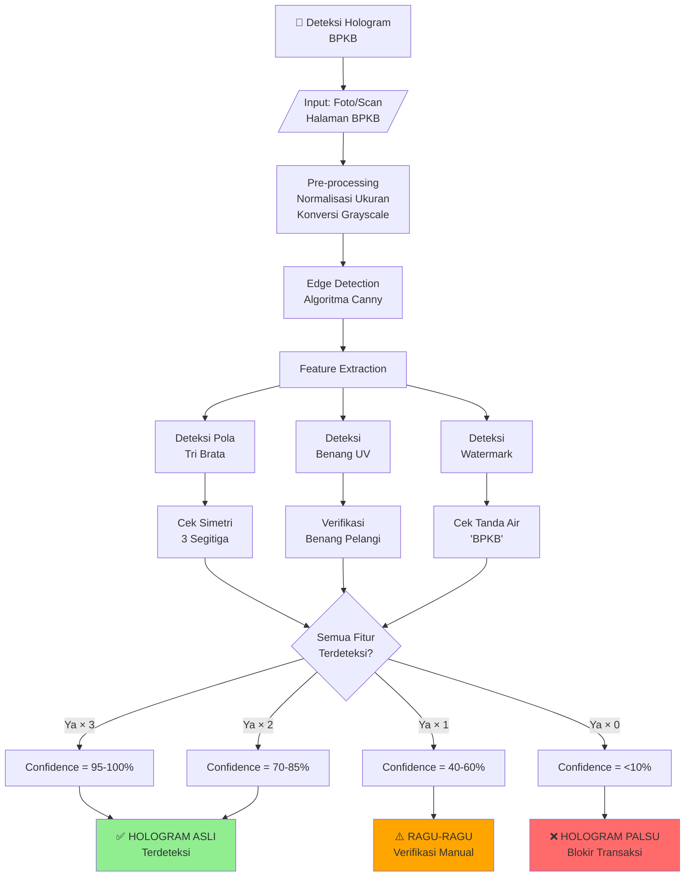
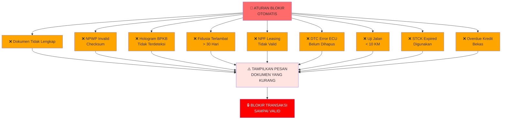
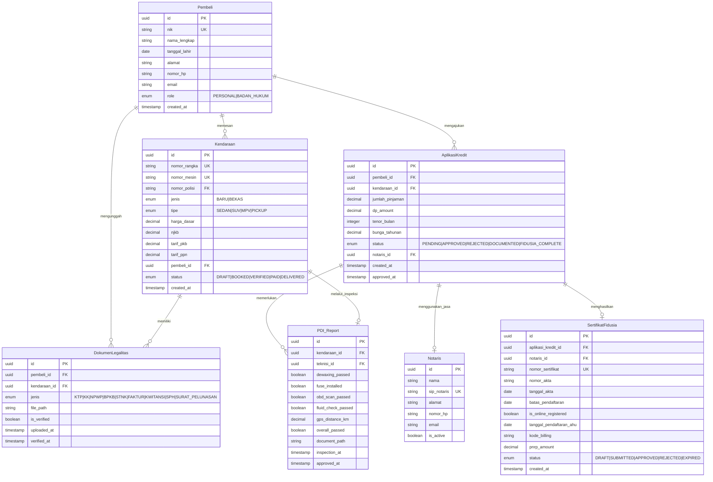

# Business Logic Mermaid.js Flowcharts
## SRS Reference: Sistem Transaksi Pembelian Kendaraan Bermotor Terintegrasi (Indonesia)

Dokumen ini berisi flowchart Mermaid.js yang menjelaskan logika bisnis, formula kalkulasi, dan aturan validasi untuk tim programmer dan Quality Assurance.

---

## 1. Kalkulasi Pajak - Pricing Engine (Sub-bab SRS: 3.4)

### 1.1 Flowchart Kalkulasi Pajak Lengkap



### 1.2 Formula Matematika Kalkulasi Pajak



---

## 2. Logika Simulasi Kredit - Fintech & Leasing (Sub-bab SRS: 3.5)

### 2.1 Flowchart Penentuan DP Dinamis Berdasarkan NPF

```mermaid
flowchart TD
    A[🚀 Inisiasi Simulasi<br/>Kredit] --> B[/Input: NIK Pembeli<br/>Harga OTR Kendaraan/]
    
    B --> C["Query SLIK OJK<br/>Ambil Riwayat Kredit"]
    
    C --> D{"Status<br/>Kolektibilitas?"}
    
    D -->|"1-5 (Lancar)"| E["✓ Layak Kredit"]
    D -->|"6-9 (Diragukan)"| F["⚠️ Perlu Analisis<br/>Surveyor"]
    D -->|"Kol 1-2)| G["⚠️ Peringkat Baik<br/>Lanjut ke NPF"]
    
    E --> H["Query NPF Leasing<br/>Partner"]
    F --> H
    G --> H
    
    H --> I["Ambil NPF Net<br/>Perusahaan Pembiayaan"]
    
    I --> J{"NPF ≤ 1%?"}
    J -->|Ya| K["📋 DP Minimum = 0%<br/>Kredit Tanpa Uang Muka"]
    
    J -->|Tidak| L{"NPF 1-3%?"}
    L -->|Ya| M["📋 DP Minimum = 10%<br/>Uang Muka Ringan"]
    
    L -->|Tidak| N{"NPF 3-5%?"}
    N -->|Ya| O["📋 DP Minimum = 15%<br/>Uang Muka Sedang"]
    
    N -->|Tidak| P{"NPF > 5%?"}
    P -->|Ya| Q["📋 DP Minimum = 20%<br/>Uang Muka Tinggi"]
    
    P -->|Tidak| R["⚠️ Error NPF<br/>Hubungi Admin"]
    
    K --> S[Hitung Angsuran]
    M --> S
    O --> S
    Q --> S
    
    S --> T["Tenor: 12-72 bulan<br/>Bunga: Sesuai Kategori"]
    
    T --> U[/Output: Simulasi<br/>DP, Angsuran, Total Bayar/]
    
    U --> V[✅ Tampilkan ke<br/>Pembeli]
    
    style K fill:#90EE90
    style M fill:#98FB98
    style O fill:#FFFF99
    style Q fill:#FFD700
    style F fill:#FFA500
    style R fill:#FF6B6B
```

### 2.2 Matrix NPF vs DP Minimum



---

## 3. Validasi Dokumen (Sub-bab SRS: 3.4 - Duplikat)

### 3.1 Matriks Validasi Berdasarkan Jenis Kendaraan

```mermaid
flowchart TD
    A[🚀 Validasi<br/>Dokumen] --> B{/Input: Jenis Kendaraan<br/>Daftar Dokumen/}
    
    B --> C{Jenis<br/>Kendaraan?}
    
    C -->|"BARU"| D["📋 Checklist Mobil Baru"]
    C -->|"BEKAS| E["📋 Checklist Mobil Bekas"]
    C -->|"BEKAS<br/>KREDIT"| F["📋 Checklist Bekas Kredit"]
    
    subgraph BARU["🆕 Mobil Baru - Validasi"]
        D --> D1["✓ Faktur Kendaraan Asli"]
        D1 --> D2["✓ NIK Valid (Checksum)"]
        D2 --> D3["✓ SRUT (Surat Registrasi<br/>Uji Tipe)"]
        D3 --> D4["✓ KTP Asli Pembeli"]
        D4 --> D5{"Tipe CBU<br/>Impor?"}
        D5 -->|"Ya"| D6["✓ Form A<br/>Tingkat Komponen<br/>Dalam Negeri"]
        D5 -->|"Tidak"| D7["✓ Selesai<br/>Tanpa Form A"]
    end
    
    subgraph BEKAS["🔄 Mobil Bekas - Validasi"]
        E --> E1["✓ BPKB Asli<br/>Hologram Tri Brata"]
        E1 --> E2["✓ Verifikasi<br/>Benang UV Sicherheit"]
        E2 --> E3["✓ STNK Aktif"]
        E3 --> E4["✓ Faktur Pembelian"]
        E4 --> E5["✓ Kwitansi Kosong<br/>2-3 Rangkap<br/>Ditandatangani<br/>Sesuai BPKB"]
        E5 --> E6{"Eks Aset<br/>Perusahaan?"}
        E6 -->|"Ya"| E7["✓ SPH<br/>Surat Pelepasan Hak"]
        E6 -->|"Tidak"| E8["✓ Selesai<br/>Tanpa SPH"]
    end
    
    subgraph BEKAS_KREDIT["🏦 Mobil Bekas dalam Kredit"]
        F --> F1["✓ Kontrak Leasing Lama"]
        F1 --> F2["✓ Fotokopi BPKB<br/>Terlegalisir"]
        F2 --> F3["✓ Histori Setoran<br/>Pembayaran Terakhir"]
        F3 --> F4{"Lunas<br/>Sebelumnya?"}
        F4 -->|"Ya"| F5["✓ Surat Keterangan<br/>Lunas dari Leasing"]
        F4 -->|"Tidak"| F6["⚠️ OVERDUE<br/>Blokir Transaksi"]
    end
    
    D6 --> G[✅ Lolos Validasi]
    D7 --> G
    E7 --> G
    E8 --> G
    F5 --> G
    F6 --> H[❌ Ditolak]
    
    G --> I[/Output: Status Validasi<br/>Dokumen Lengkap/]
    H --> J[/Output: Alasan Penolakan/]
    
    style G fill:#90EE90
    style H fill:#FF6B6B
    style F6 fill:#FF6B6B
```

### 3.2 Algoritma Validasi NPWP (Luhn Checksum)



### 3.3 Deteksi Hologram BPKB (Akurasi 95%)



### 3.4 Validasi Batas Waktu Fidusia (30 Hari)

```mermaid
flowchart TD
    A[🚀 Pendaftaran<br/>Jaminan Fidusia] --> B[/Input: Tanggal Akta Notaris<br/>Tanggal Submit ke AHU/]
    
    B --> C["Hitung Selisih Hari:<br/>Tanggal Submit - Tanggal Akta"]
    
    C --> D["Jumlah Hari = selisih"]
    
    D --> E{"Jumlah Hari ≤ 30?"}
    
    E -->|"YA| F["✅ PENDAFTARAN<br/>DITERIMA"]
    E -->|"TIDAK| G["❌ PENDAFTARAN<br/>DITOLAK OTOMATIS<br/>oleh Sistem AHU"]
    
    F --> H["Generate:<br/>Sertifikat Fidusia<br/>Elektronik"]
    
    H --> I["Simpan ke Database<br/> dengan Notifikasi<br/>Expired Reminder"]
    
    G --> J["⚠️ ALERT:<br/>Terlambat 30 Hari<br/>Blokir Transaksi Kredit"]
    
    style F fill:#90EE90
    style G fill:#FF6B6B
    style J fill:#FF6B6B
    
    subgraph REMINDER["🔔 Reminder System"]
        K["30 Hari Sebelum<br/>Batas"] -->|"Day-30"| L["📧 Notifikasi Email<br/> ke Dealer/Leasing"]
        K -->|"Day-15"| M["📱 SMS Reminder<br/> ke Admin"]
        K -->|"Day-7"| N["🔴 URGENT Alert<br/> ke Manager"]
        K -->|"Day-1"| O["🚨 FINAL WARNING<br/>Segera Daftarkan!"]
    end
```

---

## 4. Logistik & PDI - Pre-Delivery Inspection (Sub-bab SRS: 3.6)

### 4.1 Flowchart Proses PDI Lengkap

```mermaid
flowchart TD
    A[🚀 Mulai PDI<br/>Pre-Delivery Inspection] --> B[/Input: Data Unit<br/>Nomor Rangka/]
    
    B --> C["📋 Download Checklist<br/>PDI Digital<br/>150-188 Titik"]
    
    C --> D["🔍 Inspeksi Exterior:<br/>Bodi, Cat, Kaca,<br/>Lampu, Ban"]
    
    D --> E["🔧 Inspeksi Interior:<br/>Dashboard, Jok, AC,<br/>Elektrikal"]
    
    E --> F["⚙️ Inspeksi Mekanik:<br/>Mesin, Transmisi,<br/>Rem, Suspensi"]
    
    F --> G["💧 Pemeriksaan Cairan:<br/>Oli, Coolant, Rem,<br/>Windscreen"]
    
    G --> H["🔌 Koneksi OBD-II:<br/>Scan Port ECU"]
    
    H --> I{"DTC Error<br/>Terdeteksi?"}
    
    I -->|"Ya| J["⚠️ Hapus DTC Error<br/>via OBD-II Scanner"]
    I -->|"Tidak| K["✅ Tidak Ada<br/>DTC Error"]
    
    J --> K
    
    K --> L["🔧 De-waxing:<br/>Pembilasan Wax<br/>Pelindung Bodi"]
    
    L --> M["⚡ Pasang:<br/>Backup Fuse<br/>Kelistrikan"]
    
    M --> N["🚗 Uji Jalan:<br/>Minimal 10 KM"]
    
    N --> O{"Jarak Tempuh<br/>≥ 10 KM?"}
    
    O -->|"Ya| P["✅ Uji Jalan<br/>LULUS"]
    
    O -->|"Tidak| Q["⚠️ JANGAN KIRIM<br/>Lanjutkan Uji Jalan"]
    Q --> N
    
    P --> R["📝 Isi Laporan PDI<br/>Digital secara Online"]
    
    R --> S["📸 Upload Foto<br/>Unit Post-PDI"]
    
    S --> T["✅ Unit Approved<br/>Siap Dikirim"]
    
    T --> U[/Output: Laporan PDI<br/>Status: APPROVED<br/>Tanggal & Teknisi/]
    
    style P fill:#90EE90
    style T fill:#90EE90
    style Q fill:#FFA500
```

### 4.2 Detail Checklist PDI per Tahapan

```mermaid
flowchart LR
    subgraph EXTERIOR["🚗 Exterior (40 Titik)"]
        A1["Bodi Kiri"] --> A2["Bodi Kanan"]
        A2 --> A3["Depan"]
        A3 --> A4["Belakang"]
        A4 --> A5["Atap"]
        A5 --> A6["Kaca Depan"]
        A6 --> A7["Kaca Belakang"]
        A7 --> A8["Velg & Ban"]
    end
    
    subgraph INTERIOR["🚙 Interior (35 Titik)"]
        B1["Dashboard"] --> B2["Jok Depan"]
        B2 --> B3["Jok Belakang"]
        B3 --> B4["AC & Pendingin"]
        B4 --> B5["Kelistrikan"]
    end
    
    subgraph MEKANIK["⚙️ Mekanik (50 Titik)"]
        C1["Mesin"] --> C2["Transmisi"]
        C2 --> C3["Rem"]
        C3 --> C4["Suspensi"]
        C4 --> C5["Kopling"]
    end
    
    subgraph ELEKTRONIK["🔌 Elektronik (25 Titik)"]
        D1["Head Unit"] --> D2["OBD-II Scan"]
        D2 --> D3["ECU Error"]
        D3 --> D4["Sensor"]
    end
    
    subgraph UJI_JALAN["🛣️ Uji Jalan (Minimal 10 KM)"]
        E1["Akselerasi"] --> E2["Pengereman"]
        E2 --> E3["Handling"]
        E3 --> E4["Suara Mesin"]
    end
    
    style A1 fill:#87CEEB
    style B1 fill:#98FB98
    style C1 fill:#FFD700
    style D1 fill:#DDA0DD
    style E1 fill:#F0E68C
```



### 4.3 Alur STCK (Plat Nomor Sementara)

```mermaid
flowchart TD
    A[🚀 Proses STCK<br/>Pelat Nomor Sementara] --> B[/Input: Data Pembeli<br/>& Kendaraan/]
    
    B --> C["Ajukan STCK<br/>ke Samsat"]
    
    C --> D["PNBP Bayar:<br/>Rp50.000"]
    
    D --> E["Terbit STCK<br/>Berlaku 1 Bulan"]
    
    E --> F{"Tanggal Sekarang"}
    
    F --> G{"Dalam<br/>Periode STCK?"}
    
    G -->|"Ya| H{"Digunakan<br/>Untuk?"}
    
    H -->|"Logistik<br/>Diler-Konsumen"| I["✅ BOLEH<br/>Digunakan"]
    
    H -->|"Uji Fisik<br/>Samsat"| I
    
    H -->|"Keperluan<br/>Pribadi"| J["❌ DILARANG<br/>Bisa Ditilang"]
    
    H -->|"Keluar<br/>Kota"| J
    
    G -->|"Tidak| K["❌ STCK Expired<br/>Harus Perpanjang"]
    
    I --> L{"Tujuan dalam<br/>Kota yang Sama?"}
    
    L -->|"Ya| M["✅ BOLEH<br/>Digunakan"]
    
    L -->|"Tidak| J
    
    style I fill:#90EE90
    style M fill:#90EE90
    style J fill:#FF6B6B
    style K fill:#FF6B6B
```

---

## 5. Ringkasan Aturan Blokir Sistem



---

## Legenda Warna

| Warna | Arti |
|-------|------|
| 🟢 Hijau | Validasi Lulus / Selesai |
| 🟡 Kuning | Warning / Perlu Perhatian |
| 🔴 Merah | Ditolak / Blokir / Error |

---

## 6. Entity Relationship Diagram (ERD) Fisik



*Document Version: 1.0*
*Last Updated: Juni 2026*
*References: IEEE 830 SRS, UU HKPD, PMK 131/2024, Perda DKI No. 1 Tahun 2024, PP 21/2015*
